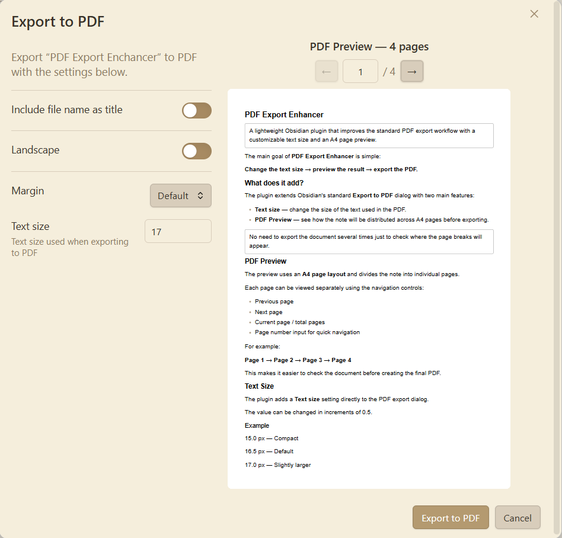

# PDF Export Enhancer

Enhance Obsidian's PDF export with a custom text size setting and an A4 page preview before exporting.

## Preview

The preview shows how the note will be laid out on A4 pages before exporting it to PDF.

The preview preserves your existing Obsidian styles, including theme settings, Style Settings, and CSS snippets. No additional styling is imposed by the plugin.

## Features

- Custom text size for PDF export
- A4 PDF preview
- Page-by-page navigation
- Support for Obsidian themes
- Support for Style Settings
- Support for CSS snippets
- Preview updates when PDF settings change

## Usage

Open Obsidian's standard **Export to PDF** dialog.

PDF Export Enhancer adds a **text size setting** and an **A4 PDF preview** to the existing export dialog.

## Settings

The text size can be configured directly in the PDF export dialog.

## Compatibility

The plugin is designed for the desktop version of Obsidian.
